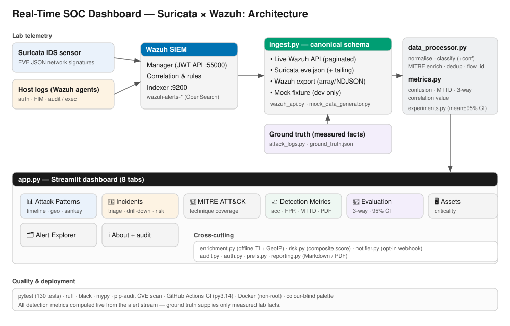
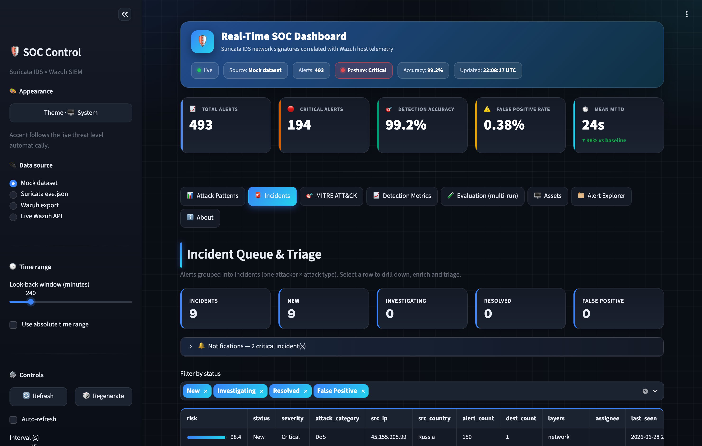
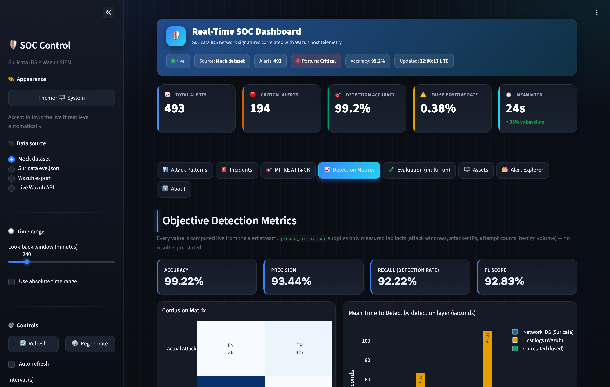
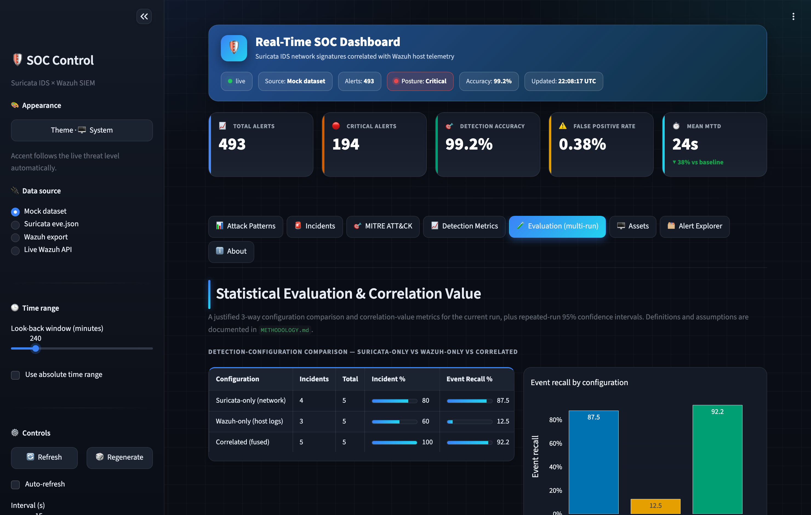
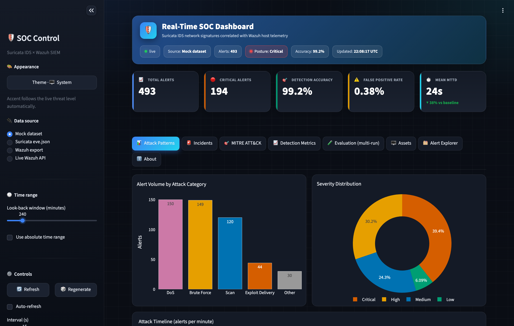
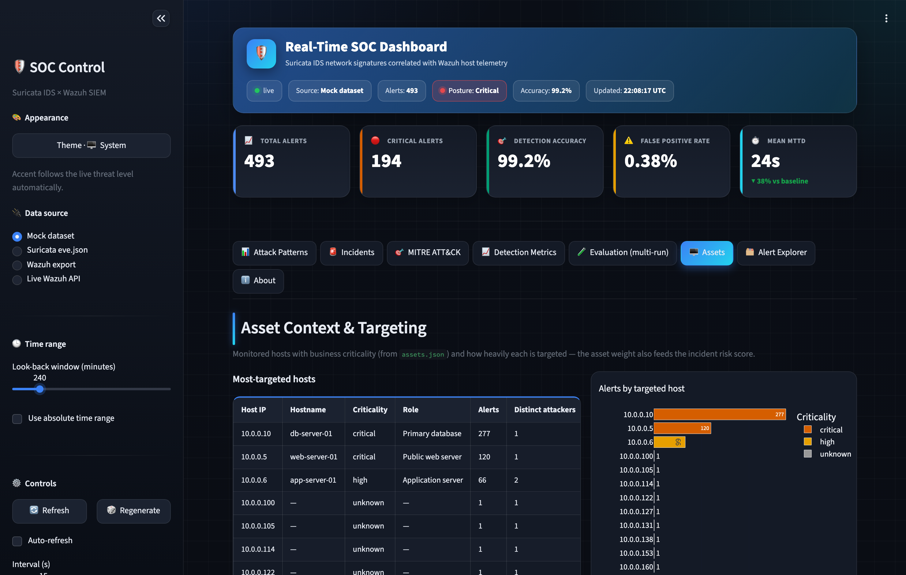

# Real-Time SOC Dashboard — Suricata × Wazuh

A production-grade Security Operations Center (SOC) dashboard that ingests
**correlated alerts** from a Wazuh SIEM (fed by a Suricata IDS sensor),
categorises the four simulated attack scenarios, maps them onto
**MITRE ATT&CK**, and computes objective evaluation metrics — **detection
accuracy, false-positive rate, and Mean Time To Detect (MTTD) improvement**.

Built for an MSc dissertation lab. It consumes **real sensor/SIEM data** —
a live Wazuh API, a real Suricata `eve.json` file (typed path **or drag-and-drop
upload**), or an exported Wazuh alerts file — and ships with a labelled offline
fixture so every chart is populated from the first launch.

> **What is real vs. fixture:** the dashboard, API client, ingestion, MITRE
> mapping, metric maths and visualisations are all real production code that
> render whatever data you feed them. The only synthetic artefact is the
> *labelled mock dataset* used for offline development; it is clearly isolated in
> the `mock` source and never mixed into a live view.



---

## 1. Quick start (one command)

You only ever run **one** thing — the dashboard, at **http://localhost:8501**.

```bash
./run.sh
```

That's it. On first launch `run.sh` creates a virtual environment, installs the
dependencies and builds the offline sample dataset, then starts the dashboard.
Every later launch just starts it.

**Even easier on macOS:** double-click **`start.command`** in Finder — it starts
the dashboard and opens your browser automatically.

Prefer to split install from run? Run the installer once, then start any time:

```bash
./setup.sh      # one-time: venv + dependencies + sample data
./run.sh        # start the dashboard (http://localhost:8501)
```

The dashboard opens in **Mock dataset** mode so every chart and metric is
populated immediately. Use the sidebar **Data source** selector to switch to your
real data (upload a file, point at a server path, or connect to the live API).

The sidebar **🎨 Appearance** button cycles **System → Dark → Light** (it defaults to
**System**, following your OS appearance automatically). Every element — buttons,
inputs, charts and tables — follows the active theme. The header shows a **live threat
posture** chip (green = all clear · blue = nominal · amber = elevated · red = critical)
computed from the real alert stream, while the brand accent stays steady.

> Running in a container instead? See **§6 — Docker** (optional; not needed for
> the normal workflow).

---

## 2. Project structure

Everything is organised into a few clear folders:

```
masters project/
├── run.sh / setup.sh / start.command   ← start / install / double-click launch
├── requirements.txt                    ← dependencies
├── README.md  LICENSE  CITATION.cff
├── src/                ← all application code
│   ├── app.py                 (Streamlit dashboard — the entry point)
│   ├── theme.py               (visual design system)
│   ├── ingest.py              (real eve.json / Wazuh export / live API / upload)
│   ├── data_processor.py  metrics.py  experiments.py
│   ├── mitre_mapping.py  wazuh_api.py  incidents.py  enrichment.py
│   ├── assets.py  risk.py  notifier.py  audit.py  auth.py  prefs.py
│   ├── reporting.py  logging_config.py  config.py
│   └── mock_data_generator.py (builds the offline sample data)
├── config/             ← editable inputs: assets.json, threat_intel.json
├── data/               ← generated/runtime data (sample dataset, uploads, runs)
│   └── samples/        ← example eve.json + Wazuh export for the upload demo
├── docker/             ← Dockerfile + docker-compose.yml (optional deployment)
├── lab/                ← scripts to build the real Suricata×Wazuh VM lab
├── docs/               ← METHODOLOGY.md, LAB_SETUP.md, RUNBOOK.md, screenshots
└── tests/              ← pytest suite (130 tests)
```

### Screenshots

| Incidents & triage | Detection metrics | Evaluation (multi-run) |
|---|---|---|
|  |  |  |

| Attack patterns | Asset context |
|---|---|
|  |  |

---

## 3. Connecting to real data

Switch the **Data source** in the sidebar. Nothing is hard-coded — credentials are
read only from environment variables, never typed into the UI.

> **Going end-to-end with your lab?** Follow **[docs/RUNBOOK.md](docs/RUNBOOK.md)** —
> it walks through launching the four attacks, getting the alerts in, recording
> ground truth (template: `docs/ground_truth.example.json`), running the multi-run
> evaluation, and mapping every output to a dissertation section.

### A. Real Suricata `eve.json` — **upload or path**
Pick **Suricata eve.json**, then choose:
- **Upload a file** *(default)* — drag-and-drop an `eve.json` (NDJSON, optionally
  `.gz`) straight from your computer. Uploaded files are stored locally under
  `data/uploads/` and are **never sent anywhere**. Tick *Try the bundled sample*
  to explore with the example file in `data/samples/`.
- **Server file path** — read a file already on the machine (default
  `/var/log/suricata/eve.json`, override with `SURICATA_EVE_PATH`). This mode also
  offers **incremental tailing** for large, continuously-growing logs.

Only `event_type: alert` events are ingested; flow/dns/http/stats are skipped.

### B. Exported Wazuh alerts — **upload or path**
Pick **Wazuh export**, then either upload a JSON-array **or** NDJSON alerts file,
or point at one on disk (`WAZUH_EXPORT_PATH`).

### C. Live Wazuh API
```bash
export WAZUH_API_URL="https://<manager-ip>:55000"
export WAZUH_API_USER="wazuh-wui"
export WAZUH_API_PASSWORD="••••••••"
export WAZUH_INDEXER_URL="https://<indexer-ip>:9200"
export WAZUH_INDEXER_USER="admin"
export WAZUH_INDEXER_PASSWORD="••••••••"
export WAZUH_VERIFY_SSL="false"   # lab self-signed certs; set true with a CA bundle
```
Then pick **Live Wazuh API** and use the sidebar **Test connection** button. The
client authenticates (JWT), retries transient failures, refreshes the token on
expiry, and reads `wazuh-alerts-*` from the Indexer (with pagination).

All sources flow through the **same** canonical schema, so processing, MITRE
mapping, metrics and UI are identical regardless of origin.

**Dashboard features:** categorised attack-pattern charts, a real-time attack
timeline, a source-IP → attack → ATT&CK-tactic correlation Sankey, an attacker
GeoIP map, an **Incident queue with triage** (status + assignee + notes) and
click-through **drill-down** with **threat-intel enrichment**, the MITRE ATT&CK
interpretation view (rule-vs-inferred provenance), live detection metrics with a
**noisiest-rules (false-positive) analysis** and a **benign-population sensitivity
analysis**, the multi-run **Evaluation** tab, an on-demand **pipeline throughput
benchmark** (About tab / `python src/benchmark.py`), a **searchable/filterable**
alert feed with CSV export, and one-click **Markdown + PDF** analyst reports.
Auto-refresh is non-blocking.

---

## 4. The four simulated attacks

| Attack | Example Suricata signature | MITRE techniques | Correlated host evidence |
|--------|----------------------------|------------------|--------------------------|
| **Scan** (recon) | `ET SCAN Nmap -sS`, `ET SCAN Potential SSH Scan` | T1595, T1046, T1018 | — |
| **Brute Force** | `ET SCAN SSH BruteForce Tool` | T1110, T1110.001 | `sshd` auth failures (`/var/log/auth.log`) |
| **DoS** | `ET DOS SYN Flood`, `NTP DDoS MON_LIST` | T1498, T1499 | — |
| **Exploit Delivery** | `ET EXPLOIT log4j RCE (CVE-2021-44228)`, SQLi, Struts OGNL | T1190, T1203, T1059 | FIM web-shell add, suspicious command exec |

Brute-force and exploit campaigns emit **host-log alerts alongside the network
signature**, demonstrating the multi-source correlation shown in the Sankey
"Attack Correlation Flow" (source IP → attack → ATT&CK tactic).

**MITRE provenance is explicit.** Where a rule carries ATT&CK metadata it is used
verbatim (`mitre_source = rule`); where it does not, representative techniques are
*inferred* from the classified attack type (`mitre_source = inferred`). The MITRE
tab reports the rule-vs-inferred split so the mapping is auditable.

---

## 5. Metric definitions & ground truth

**Every metric is computed live from the alert stream — no result is ever stored.**
`data/ground_truth.json` holds *only the measured lab facts* a SOC analyst
genuinely knows about their own actions. It is generated automatically for the
sample dataset; for **real lab runs**, record what you launched in the same shape:

```json
{
  "campaigns": [
    {
      "attack_type": "Brute Force",
      "source_ip": "45.155.205.99",
      "start_time": "2026-07-01T10:00:00.000+0000",
      "end_time":   "2026-07-01T10:08:00.000+0000",
      "malicious_attempts": 150
    }
  ],
  "benign": { "benign_events": 8000 }
}
```

The dashboard then derives everything itself:

- An alert is a **True Positive** when its source IP + timestamp fall inside a
  campaign window; an alert matching no window is a **False Positive**.
- **Detected** = distinct network detections matched to a window ·
  **Missed (FN)** = `malicious_attempts − detected` · **TN** = `benign_events − FP`.
- **Accuracy** = (TP+TN)/(TP+TN+FP+FN) · **Precision** = TP/(TP+FP) ·
  **Recall / Detection Rate** = TP/(TP+FN) · **FPR** = FP/(FP+TN)
- **MTTD** per layer = `first matched alert of that layer − start_time`, measured
  from real timestamps. **Correlated MTTD** = first alert from *either* layer.
- **MTTD Improvement** = (host-only baseline − correlated) / baseline. Where host
  logs never fire (e.g. Scan, DoS), the attack is detectable *only* via the
  network sensor / correlation — reported explicitly rather than as a number.

Change the alert stream and every figure changes; the identical code path runs
for mock, eve.json and live data.

### Statistical evaluation (multi-run)

A single run is one data point. The **Evaluation tab** (and `experiments.py`)
repeat the study over N independent runs and report every metric as
**mean ± 95% confidence interval** (Student's t), plus:

- a **justified 3-way baseline** — Suricata-only vs Wazuh-only vs Correlated —
  with incident detection rate, event recall and MTTD per configuration;
- **correlation-value** metrics — alert→incident reduction ratio, multi-source
  confirmed incidents, and incidents a single-source SOC would miss.

Generate runs from the tab, or:

```bash
python src/experiments.py -n 15      # writes data/runs/run_NN/ and prints the CI table
```

### Dissertation document set (`docs/`)

| Document | Use |
|----------|-----|
| **[METHODOLOGY.md](docs/METHODOLOGY.md)** | Research questions, labelling, metric formulas, baseline justification, limitations. |
| **[LAB_SETUP.md](docs/LAB_SETUP.md)** | Build the real Suricata×Wazuh VM lab (scripts in `lab/`) that produces the data. |
| **[RUNBOOK.md](docs/RUNBOOK.md)** | End-to-end: launch the four attacks → ingest → ground truth → validate → evaluate. |
| **[RESULTS_AND_DISCUSSION.md](docs/RESULTS_AND_DISCUSSION.md)** | Results & Discussion chapter scaffold (illustrative figures + RQ→evidence map + limitations); fill with your real lab numbers. |
| **[RELATED_WORK.md](docs/RELATED_WORK.md)** | Related-work positioning table (vs Wazuh/Kibana/Splunk) for the literature review & discussion. |
| **[USABILITY_EVALUATION.md](docs/USABILITY_EVALUATION.md)** | Heuristic (Nielsen) usability evaluation of the dashboard — no participants/ethics required. |
| **[SECURITY_AUDIT.md](docs/SECURITY_AUDIT.md)** | End-to-end security review of the tool itself: findings, remediations, accepted risks, and verified-clean areas. |
| **[ground_truth.example.json](docs/ground_truth.example.json)** | Real-lab ground-truth template. |

A pre-flight check (`python src/validate_run.py --source … --path …`, or `make
validate`) verifies a real capture is metric-ready before evaluation.

---

## 6. Docker (optional)

Not required for the normal workflow — `./run.sh` is all you need. For a
reproducible container deployment:

```bash
docker compose -f docker/docker-compose.yml up --build     # http://localhost:8501
# or
make docker-build && make docker-run
```

`docker/docker-compose.yml` includes a read-only mount of `/var/log/suricata` so
the container ingests the host's **real** eve.json, plus a commented env block for
live Wazuh credentials. The image runs as a non-root user and has a Streamlit
health-check.

---

## 7. Testing & code quality

```bash
make dev          # install runtime + test/lint deps
make verify       # ONE command: lint + format + types + 130 tests + app smoke render
# …or run any gate on its own:
make test         # run the suite (130 tests)
make cov          # run with coverage report
make audit        # scan pinned runtime deps for known CVEs (pip-audit)
ruff check .      # lint
black --check .   # format check
mypy .            # type check
```

Quality is enforced by running these gates locally before every change. The
single **`make verify`** target runs the full pre-publication check —
linting (**ruff**), formatting (**black**), type-checking (**mypy**), the full
test suite, and a headless render of the dashboard that fails on any exception —
all of which pass. A ready-to-use continuous-integration workflow is included
at `.github/workflows/ci.yml`; it runs `make verify` automatically if the
project is ever pushed to GitHub.

### Security & accessibility
The tool has been through an end-to-end security review — scope, findings,
remediations and accepted risks are documented in
**[docs/SECURITY_AUDIT.md](docs/SECURITY_AUDIT.md)**. Highlights:
- **Uploads stay local** — uploaded eve.json / export files are written only to
  `data/uploads/` (filename reduced to its base name, so no path traversal) and
  are never transmitted anywhere.
- **Output encoding** — every raw-HTML sink escapes its text and validates colours
  through an allow-list, so alert-derived strings can never inject (regression-pinned
  in `tests/test_security.py`).
- **Optional auth** — enable with `SOC_AUTH_ENABLED=true` + `SOC_AUTH_PASSWORD_HASH`
  (off by default so the demo/tests aren't gated). Passwords are SHA-256 hashed
  and compared in constant time; XSRF protection is pinned on.
- **Enrichment is offline by default** — no external service is contacted unless
  the operator deliberately enables and configures online lookups.
- **Dependency CVE scanning** — a dedicated CI job (and `make audit`) runs
  `pip-audit` against the pinned runtime dependencies on every push.
- **Non-root container** — the image runs as an unprivileged `appuser` (uid 10001);
  `.dockerignore` keeps secrets and local data out of the image.
- **Colour-blind-safe** charts (Okabe–Ito palette).

The suite (`tests/`) covers Suricata→canonical mapping, gzip + malformed-record
handling, file uploads, attack classification, MITRE enrichment provenance, the
full eve.json→DataFrame pipeline, every metric formula (hand-verified numbers),
output-encoding/XSS hardening of the HTML sinks, and the Wazuh API client (auth,
fetch, retry, 401 token refresh) with a mocked HTTP session.

---

## 8. Data & configuration

### Generated data (`data/`, safe to delete — rebuilt by `make generate`)

| Path | Purpose |
|------|---------|
| `data/wazuh_alerts.json` | Sample Wazuh alert documents (canonical schema). |
| `data/suricata_eve.json` | Sample raw Suricata EVE `alert` events (sensor format). |
| `data/ground_truth.json` | Labelled campaign ledger for metric calculation. |
| `data/samples/` | Small example eve.json + Wazuh export for the upload demo. |
| `data/uploads/` | Where your uploaded files are saved for ingestion. |
| `data/runs/` | Per-run datasets for the multi-run Evaluation tab. |

Regenerate with `make generate` or the sidebar **🎲 Regenerate** / **♻️ Reset**
buttons. Each regeneration draws a **fresh random seed**, so every dataset is
different — varied attack mixes, attacker IPs, source countries, volumes and
timing — while always covering the four core attack types. For **reproducible**
output (e.g. a fixed figure), pass an explicit seed:
`python -c "import sys; sys.path.insert(0,'src'); import mock_data_generator as m; m.generate(seed=42)"`.
The multi-run **Evaluation** study (`experiments.py`) uses fixed per-run seeds so
its confidence-interval results are reproducible.

### Editable inputs (`config/`)

| File | Purpose |
|------|---------|
| `config/assets.json` | Asset inventory + host criticality (drives the risk score). |
| `config/threat_intel.json` | Local, offline threat-intel feed for enrichment. |

### Environment variables

| Env var | Default | Purpose |
|---------|---------|---------|
| `WAZUH_API_URL` / `WAZUH_API_USER` / `WAZUH_API_PASSWORD` | `https://localhost:55000` / `wazuh` / – | Manager API (JWT). |
| `WAZUH_INDEXER_URL` / `WAZUH_INDEXER_USER` / `WAZUH_INDEXER_PASSWORD` | `https://localhost:9200` / `admin` / – | Indexer (alert source). |
| `WAZUH_ALERTS_INDEX` | `wazuh-alerts-*` | Index pattern queried. |
| `WAZUH_VERIFY_SSL` | `false` | TLS verification (set `true` with a CA bundle). |
| `WAZUH_HTTP_RETRIES` / `WAZUH_HTTP_BACKOFF` | `3` / `0.5` | Retry policy for transient failures. |
| `SURICATA_EVE_PATH` | `/var/log/suricata/eve.json` | Real eve.json path (server-path mode). |
| `WAZUH_EXPORT_PATH` | – | Exported alerts file path (server-path mode). |
| `SOC_LOG_LEVEL` | `INFO` | Application log level. |
| `SOC_AUTH_ENABLED` / `SOC_AUTH_USERNAME` / `SOC_AUTH_PASSWORD_HASH` | `false` / `analyst` / – | Optional login gate (SHA-256 hash; `*_FILE` variant for Docker secrets). |
| `THREAT_INTEL_FILE` / `THREAT_INTEL_ONLINE` | `config/threat_intel.json` / `false` | Local TI feed path; online lookups stay off unless enabled. |
| `SOC_ASSETS_FILE` | `config/assets.json` | Asset inventory (host criticality) for the risk score. |
| `SOC_WEBHOOK_URL` / `SOC_WEBHOOK_MIN_LEVEL` | – / `12` | Opt-in critical-incident webhook (off unless a URL is set). |
| `SOC_AUDIT_LOG` | `data/audit.log` | Audit log path. |
| `WAZUH_PAGE_SIZE` | `10000` | Indexer pagination page size. |

---

## 9. License & citation

Released under the [MIT License](LICENSE). If you use it in academic work, please
cite via [CITATION.cff](CITATION.cff) (update the author field with your name).
